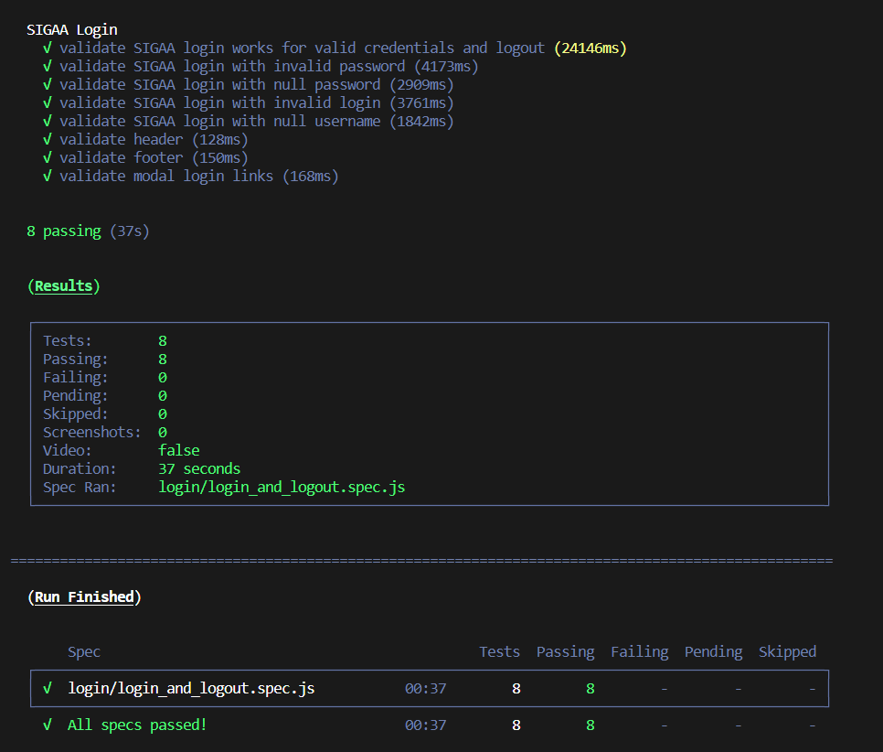

<h1 align="left">:computer: SIGAA_Test_Automation  </h1>

This is an automated test for SIGAA login 

## Introduction

This project contains some test cases validating the login page and the SIGAA login using four different screen formats.

## Environment Setup

**Prerequisites:**
* <a href="https://docs.npmjs.com/cli/v6/commands/npm-install"> Node.JS </a>

## Installing Dependencies

- This command installs a package, and any packages that it depends on.
```
npm install
```

## Run Code Cypress:

- Run Cypress to start the framework:
```
npx cypress open
```
- Run without open Cypress
```
npx cypress run
```
- Run a specific test
```
npm run cy:test "root/folder/file.spec.js"
```

## Results

<p align="left">
  
</p>
</br>

## Author
<a target="_blank" href="https://github.com/jasonwillyan">👤 Jason Willyan </a>

<a target="_blank" href="mailto:jasonwillyan@hotmail.com">
  
</a>


